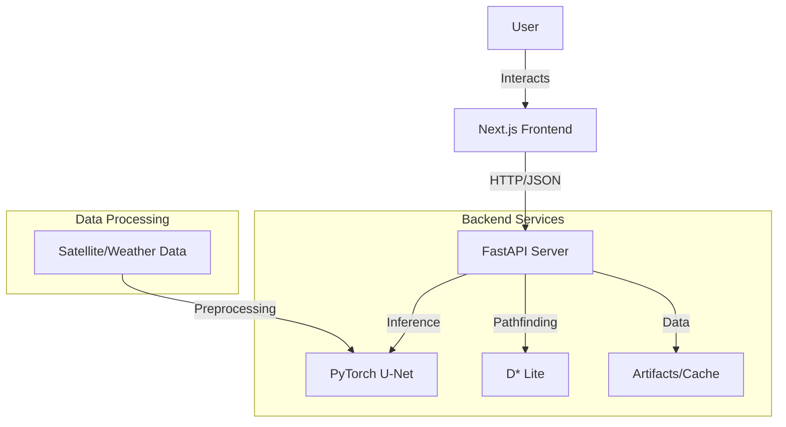

# Forest-Fire Prediction & Simulation Platform

<div align="center">


**A cutting-edge full-stack application for real-time forest fire prediction, 3D simulation, and safe path planning using Deep Learning.**

[Features](#key-features) • [Architecture](#architecture) • [Getting Started](#getting-started) • [Contributing](#contributing)

</div>

---

## Overview

**Forest-Fire** is an integrated platform designed to assist in wildfire management and prevention. By leveraging satellite data, deep learning (U-Net), and pathfinding algorithms (D* Lite), this tool provides actionable insights into fire spread and safe evacuation routes.

The system consists of a robust **FastAPI** backend that serves predictions from a PyTorch-based model, and a modern **Next.js** frontend that visualizes data in 3D, offers simulation controls, and provides an interactive dashboard for decision-makers.

## Key Features

*   **Deep Learning Predictions:** Utilizes a U-Net architecture to predict fire spread probability based on environmental factors (temperature, humidity, wind, rain).
*   **3D Map Visualization:** Interactive 3D terrain and fire visualization using `Three.js` and `@react-three/fiber`.
*   **Safe Path Planning:** Implements the D* Lite algorithm to calculate dynamic safe paths for rescue teams or evacuation.
*   **Interactive Dashboard:** Real-time analytics, user-friendly controls, and comprehensive data reporting.
*   **Simulation Sandbox:** Test different scenarios and visualize potential fire outcomes in a controlled environment.
*   **AI Assistant:** Integrated chat interface for querying system data and insights.

## Architecture

The project follows a modern microservices-like architecture:



## Tech Stack

<details>
<summary><strong>Frontend</strong></summary>

*   **Framework:** [Next.js 15](https://nextjs.org/)
*   **Language:** TypeScript
*   **Styling:** Tailwind CSS, Shadcn UI
*   **Visualization:** React Three Fiber, Recharts, Leaflet
*   **State/Network:** Axios, React Hook Form
</details>

<details>
<summary><strong>Backend & Server</strong></summary>

*   **Framework:** [FastAPI](https://fastapi.tiangolo.com/)
*   **Server:** Uvicorn
*   **Language:** Python 3.10+
*   **Validation:** Pydantic
</details>

<details>
<summary><strong>Machine Learning</strong></summary>

*   **Deep Learning:** PyTorch, TensorFlow (Legacy)
*   **Architecture:** U-Net (Custom implementation)
*   **Data Processing:** NumPy, Pandas, Scikit-learn
*   **Pathfinding:** D* Lite Algorithm
</details>

## Project Structure

```bash
/
├── Frontend/           # Next.js Web Application
│   ├── app/            # App Router pages (Dashboard, Simulation, etc.)
│   ├── components/     # Reusable UI components (Three.js scenes, Charts)
│   └── ...
├── Server/             # FastAPI Backend
│   ├── app/
│   │   ├── main.py     # API Entry point
│   │   ├── d_star_lite.py # Pathfinding logic
│   │   └── ...
│   └── ...
├── Model/              # ML Research & Training
│   ├── src/            # Model definitions (UNet)
│   ├── weights/        # Trained model checkpoints
│   ├── dataset/        # Training data
│   └── ...
└── ...
```

## Getting Started

Follow these instructions to set up the project locally.

### Prerequisites

*   **Node.js** (v18+ recommended)
*   **Python** (v3.10+)
*   **Git**

### 1. Clone the Repository

```bash
git clone https://github.com/AceofStades/Forest-Fire.git
cd Forest-Fire
```

### 2. Backend Setup (FastAPI)

Navigate to the Server directory, create a virtual environment, and install dependencies.

```bash
cd Server

# Create virtual environment
python -m venv venv
source venv/bin/activate  # On Windows: venv\Scripts\activate

# Install dependencies
pip install -r requirements.txt

# Run the server
uvicorn app.main:app --reload --port 8000
```
> The API will be available at `http://localhost:8000`.

### 3. Frontend Setup (Next.js)

Open a new terminal, navigate to the Frontend directory.

```bash
cd Frontend

# Install dependencies
npm install  # or pnpm install / yarn install

# Run the development server
npm run dev
```
> The application will be running at `http://localhost:3000`.

### 4. ML Model Setup (Optional)

If you wish to retrain the model or explore the datasets:

```bash
cd Model
pip install -r requirements.txt
# Check src/ for model definitions and train.py for training scripts
```

## Contributing

Contributions are welcome! Please feel free to submit a Pull Request.

1.  Fork the Project
2.  Create your Feature Branch (`git checkout -b feature/AmazingFeature`)
3.  Commit your Changes (`git commit -m 'Add some AmazingFeature'`)
4.  Push to the Branch (`git push origin feature/AmazingFeature`)
5.  Open a Pull Request

## Credits

This project is brought to you by:

*   **[AceofStades](https://github.com/AceofStades)** - Machine Learning Engineer
*   **[Vishalbarai007](https://github.com/vishalbarai007)** - Backend Engineer
*   **[SRB114719](https://github.com/SRB114719)** - Web Engineer

## License

Distributed under the MIT License. See `LICENSE` for more information.
